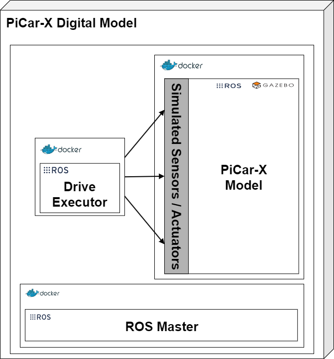

**This section is based on the publications and we recommend to read both:**
>[1] Barbie, A., & Hasselbring, W. (2024). From Digital Twins to Digital Twin Prototypes: Concepts, Formalization, and Applications. IEEE Access. [https://doi.org/10.1109/access.2024.3406510](https://doi.org/10.1109/access.2024.3406510)

>[2] Barbie, A., & Hasselbring, W. (2024). Toward Reproducibility of Digital Twin Research: Exemplified with the PiCar-X. arXiv preprint arXiv:2408.13866. [https://doi.org/10.48550/ARXIV.2408.13866](https://doi.org/10.48550/ARXIV.2408.13866)

# Context

In our formalization [1], the digital model is represented by a software state machine model. This PiCar-X example demonstrates the approach with a CAD model in a [GAZEBO](https://gazebosim.org) simulation, an open-source tool integrated with ROS, as digital model.
We define a **digital model** as follows [1]: 

# Definition

A **digital model** describes an object, a process, or a complex aggregation. The description is either a mathematical or a computer-aided design (CAD).

## Key Points:
- Provides a virtual, often simplified, version of the physical twin.
- Can be used for simulations and testing without interacting with the actual hardware.
- For the PiCar-X, a CAD model is used in a GAZEBO simulation, representing the car's dimensions and driving behavior.

---

# A Digital Model of the PiCar-X
In general, software is fundamentally a mathematical structure. CAD models are mathematical models, too. However, the distinction made here between CAD models and mathematical models is to facilitate a clearer understanding of the concept and better imagination.

Lacking official CAD files for the PiCar-X, we utilized a [simplified CAD model of an older SunFounder PiCar version, available under Apache 2.0 license on GitHub](https://github.com/Theosakamg/PiCar_Hardware). This model, consisting of just the frame and wheels, closely mirrors the original PiCar-X's key dimensions like wheelbase and track, crucial for an accurate Ackermann steering simulation. However, the original PiCar-X's steering mechanism, operated by a steering bar to achieve Ackermann angles, could not be replicated in [GAZEBO](https://gazebosim.org). Instead, we approximate the Ackermann steering angles for both front wheels based on established methodologies [2].

A digital model in general has no connection to the physical system. Changes made on the physical system do not affect the digital model and vice versa, changes on the digital model do not affect the physical system, as shown in the following figure [3,1]:

The [*ros_control*](https://wiki.ros.org/ros_control) package is used to simulate the sensors and actuators, which offers topics for manipulating the model's joints for steering and wheel movement. In this setup, four joints need manipulation, including approximating the steering angles. Direct command-line control in ROS could introduce delays, and since the PiCar-X operates with pulse widths rather than angles and speed values, the digital model includes a node that translates pulse widths into angles. This node receives a *DriveStatus* message, converts the pulse widths for the motors and steering, and then publishes the calculated values to the joints. Both the ROS node and the GAZEBO simulation are connected to the same ROS Master, ensuring seamless integration [2].

Conintnue reading with [digital template]({{ site.baseurl }}).

# Futher References
>[3] Kritzinger, W., Karner, M., Traar, G., Henjes, J., & Sihn, W. (2018). Digital Twin in manufacturing: A categorical literature review and classification. Ifac-PapersOnline, 51(11), 1016-1022. [https://doi.org/10.1016/j.ifacol.2018.08.474](https://doi.org/10.1016/j.ifacol.2018.08.474)