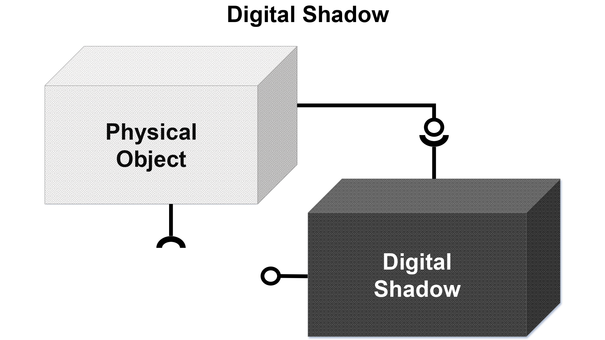
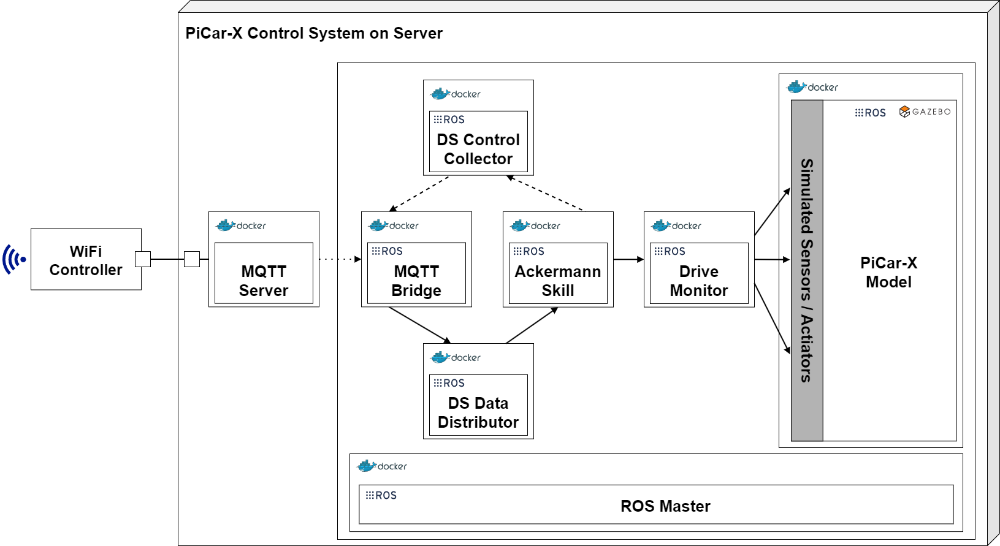

**This section is based on the publications:**
>[1] Barbie, A., & Hasselbring, W. (2024). From Digital Twins to Digital Twin Prototypes: Concepts, Formalization, and Applications. IEEE Access. [https://doi.org/10.1109/access.2024.3406510](https://doi.org/10.1109/access.2024.3406510)

>[2] Barbie, A., & Hasselbring, W. (2024). Toward Reproducibility of Digital Twin Research: Exemplified with the PiCar-X. arXiv preprint arXiv:2408.13866. [https://doi.org/10.48550/ARXIV.2408.13866](https://doi.org/10.48550/ARXIV.2408.13866)

# Context
In this setup, monitoring the state of the physical twin aligns with concepts of cyber-physical system, with a distinctive focus on the digital model as a central, continuously updated element reflecting the physical twin’s state [2, 1]. The [digital thread]({{ site.baseurl }}) is used to connect the physical twin to the digital shadow and all changes on the physical twin change the status of the digital shadow. Vice versa, changes on the digital shadow are not automatically reflected to the physical twin. Using the box model from Kritzinger et al. [3], the digital shadow can be depicted as [3, 1]:

# Definition

A **digital shadow** is the sum of all the data that are gathered by an embedded system from sensing, processing, or actuating. The connection from a physical twin to its digital shadow is automated. Changes on the physical twin are reflected to the digital shadow automatically. Vice versa, the digital shadow does not change the state of the physical twin.

## Key Points:
- Automatically updates based on the physical twin’s data.
- One-way communication: physical twin data is reflected in the digital shadow.
- In the PiCar-X setup, the digital shadow monitors the car's data, such as motor speed and steering angles, but does not alter its behavior.

---

# Digital Shadow of the PiCar-X
By integrating the essential [ADTF]({{ site.baseurl }}) components and the Ackermann skill into the digital shadow, and reusing components from the physical twin, the presented approach aims to reduce possible integration errors when incorporating the digital model into the digital shadow. Heithoff, Hellwig, Michael, and Rumpe [4] describe this approach to enhance the sustainability of the embedded control software. At the physical twin's site, the Ackermann Drive Skill bundles the motor statuses and the clutchgear status into a *DriveStatus* event, which contains motor and clutchgear pulse widths. A separate node, the *Drive Monitor*, interprets these pulse widths as angles and speeds, updating the digital model in the GAZEBO simulation. This entire process is automated, with no feedback loop to the physical twin yet established as illustrated in the following figure:

 

A short [code inspection of the *Drive Monitor* skill](https://github.com/cau-se/ARCHES-PiCar-X/blob/main/PiCar-X/ros/skills/ackermann_drive/nodes/ackermann_monitor_ds.py) shows a problem with this approach. The code to move the PiCar-X in the GAZEBO simulation is more or less doubled. We took most parts from the emulators and adjusted them a little bit. Furthermore, we set a wrong joint velocity factor on purpose, which causes the PiCar-X in the simulation to drive slower than in reality. This can be quite a common bug, if you have to modify a value on several locations. Forgetting one on the digital twin, could lead to a completely wrong impression of the behavior of the real system.

[Test this part using docker compose]({{ site.baseurl }}) or continue reading with [digital twin]({{ site.baseurl }}).

# Further References
>[3] Kritzinger, W., Karner, M., Traar, G., Henjes, J., & Sihn, W. (2018). Digital Twin in manufacturing: A categorical literature review and classification. Ifac-PapersOnline, 51(11), 1016-1022. [https://doi.org/10.1016/j.ifacol.2018.08.474](https://doi.org/10.1016/j.ifacol.2018.08.474)

>[4] M. Heithoff, A. Hellwig, J. Michael, and B. Rumpe. Digital Twins for Sustainable Software Systems. In 2023 IEEE/ACM 7th International Workshop on Green And Sustainable Software (GREENS). IEEE, May 2023. [https://doi.org/10.1109/greens59328.2023](https://doi.org/10.1109/greens59328.2023)