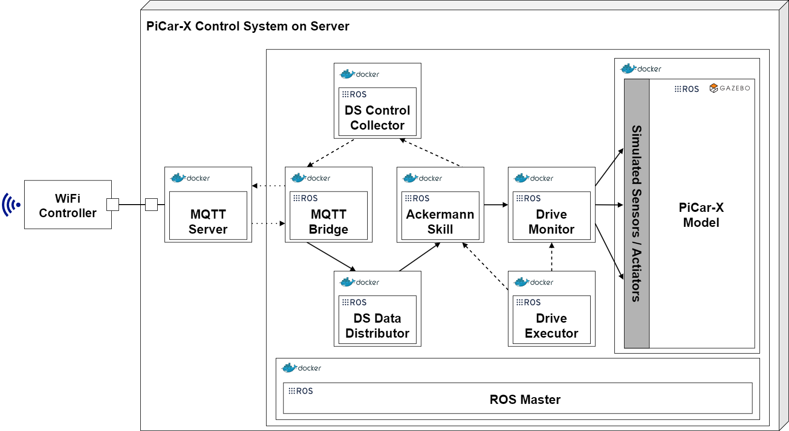

**This section is based on the publications:**
>[1] Barbie, A., & Hasselbring, W. (2024). From Digital Twins to Digital Twin Prototypes: Concepts, Formalization, and Applications. IEEE Access. [https://doi.org/10.1109/access.2024.3406510](https://doi.org/10.1109/access.2024.3406510)

>[2] Barbie, A., & Hasselbring, W. (2024). Toward Reproducibility of Digital Twin Research: Exemplified with the PiCar-X. arXiv preprint arXiv:2408.13866. [https://doi.org/10.48550/ARXIV.2408.13866](https://doi.org/10.48550/ARXIV.2408.13866)

# Context

The primary distinction between a digital shadow and a digital twin lies in the nature of their communication with the physical twin. In a digital twin setup, communication is bidirectional: any changes made to the digital twin are automatically replicated in the physical twin [2]. Using the boxes from Kritzinger et al. [3, 1] again, this looks like:

# Definition

A **digital twin** is a digital model of a real entity, the physical twin. It is both a digital shadow reflecting the status/operation of its physical twin, and a digital thread, recording the evolution of the physical twin over time. The digital twin is connected to the physical twin over the entire life cycle for automated bidirectional data exchange, i.e. changes made to the digital twin lead to adapted behavior of the physical twin and vice-versa.

## Key Points:
- Supports (near) real-time, two-way interaction between the digital and physical twins.
- Changes in the digital model can impact the physical twin, and changes in the physical twin are reflected in the digital twin.
- For the PiCar-X, commands issued to the digital twin are simultaneously sent to the physical car, influencing its behavior.

---

# Digital Twin of the PiCar-X
A digital twin of the PiCar-X achieved by modifying the [*Driver Monitor* node from the [digital shadow]]({{ site.baseurl }}), allowing data from the physical twin to continue updating the digital model, while the introduction of a *Drive Executor* node facilitates sending commands that affect both the digital and physical twins simultaneously [2]. The setup in ROS could look tike this [2]:

 

This setup ensures that any alterations in the digital twin are mirrored in the physical counterpart. However, instead of developing the separate node *Driver Monitor*, the reuse of the *Ackermann Steering Skill* in the digital twin offers an advantage over implementing a separate control node, particularly in managing steering angles in the digital model. The skill prevents under-steering for angles exceeding 20 degrees, a challenge identified in the digital model due to the Ackermann steering angle approximation. For larger steering angles, the digital model would have a larger turning radius than the real PiCar and hence, the physical twin and the digital twin would differ while moving. Implementing a separate filtering logic in a separate node at the digital twin process for steering-angle input might introduce additional failure points, as it would require duplication of the filter on both the physical and digital twins, rather than reusing the physical twin’s existing logic [2].

This example has no separate docker compose file to be executed, as we enhance this example by using [digital twin prototype (continue reading)]({{ site.baseurl }}) as digital twin. The difference to the digital twin prototype are only the ROS nodes that handle the exchange between a physical twin and digital twin. The physical twin uses nodes that receive commands and send data/statuses. The digital twin uses nodes that receive data/status and send commands.

# Futher References
>[3] Kritzinger, W., Karner, M., Traar, G., Henjes, J., & Sihn, W. (2018). Digital Twin in manufacturing: A categorical literature review and classification. Ifac-PapersOnline, 51(11), 1016-1022. [https://doi.org/10.1016/j.ifacol.2018.08.474](https://doi.org/10.1016/j.ifacol.2018.08.474)