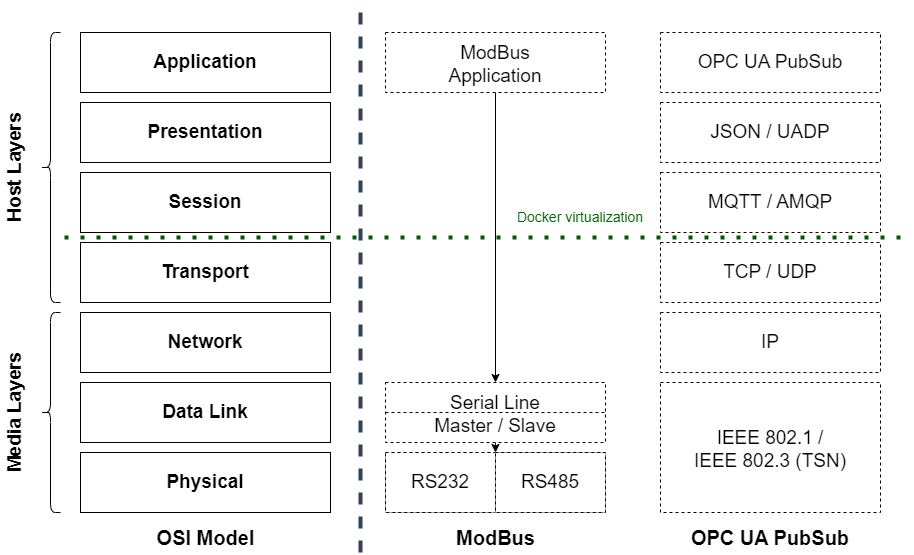
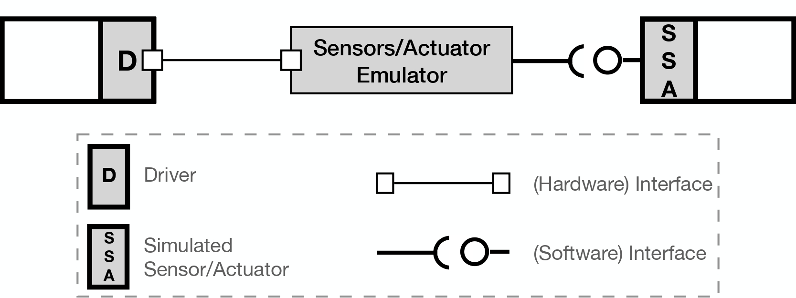
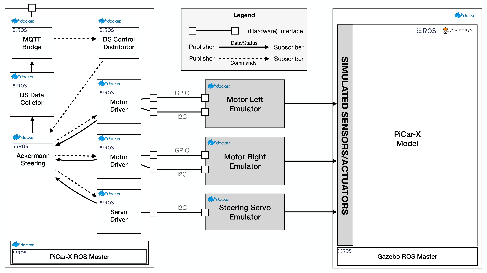
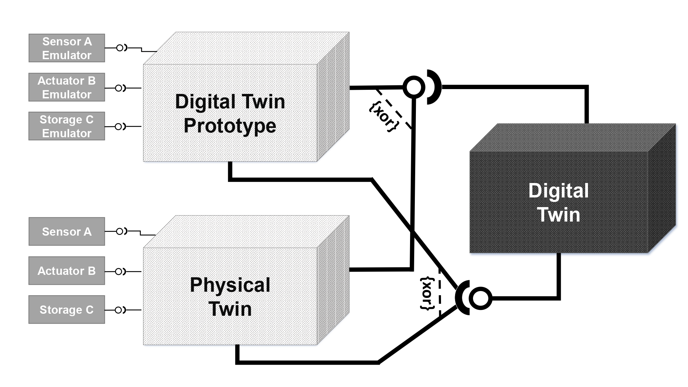

**This section is based on the publications:**
>[1] Barbie, A., & Hasselbring, W. (2024). From Digital Twins to Digital Twin Prototypes: Concepts, Formalization, and Applications. IEEE Access. [https://doi.org/10.1109/access.2024.3406510](https://doi.org/10.1109/access.2024.3406510)

>[2] Barbie, A., & Hasselbring, W. (2024). Toward Reproducibility of Digital Twin Research: Exemplified with the PiCar-X. arXiv preprint arXiv:2408.13866. [https://doi.org/10.48550/ARXIV.2408.13866](https://doi.org/10.48550/ARXIV.2408.13866)

# Context
A common approach for programming embedded software systems involves developing the software using an Integrated Development Environment (IDE) on a computer. The program is then built and uploaded to the target system, such as a microcontroller. If the program requires access to sensors or actuators, these devices must be connected to the target hardware. Afterward, the program is executed to validate whether the sensors and actuators exhibit the expected behaviors. This approach, known as Hardware-in-the-Loop (HIL), has been the standard in embedded software development for over four decades [3, 1]. In many HIL setups, the hardware is located in close proximity to the engineer's computer workstation.

The necessity for engineers to connect hardware to the target system can be illustrated using Modbus and OPC UA applications within the OSI model (as shown in the figure below). Unlike Ethernet-based communication protocols that implement and cover all layers of the OSI model, communication protocols based on serial connections - such as Modbus or CANBus - operate primarily at the 7th layer, the Application Layer. They lack additional host layers; sending and receiving data are handled directly by the *Data Link* and *Physical Layers*. This means that the physical hardware manages the essential actions required for data exchange, making it difficult to mock these layers. In contrast, communication protocols based on TCP/IP, such as OPC UA, can be easily mocked by opening a socket on the TCP layer and connecting another piece of software to it. However, this is not feasible for serial protocols. When attempting to connect, the driver tries to establish a connection to another device via RS-232. If no device is connected, the attempt fails and a connection error is thrown [1].

 

The goal of the digital twin prototype is to replace the entire physical twin during development. To do so, it is necessary to also include the connections between the physical hardware and the embedded control software, including the communication protocols.

# Definition

A **Digital Twin Prototype (DTP)** is the software prototype of a physical twin. The configurations are equal, yet the connected sensors/actuators are emulated. To simulate the behavior of the physical twin, the emulators use existing recordings of sensors and actuators. For continuous integration testing, the DTP can be connected to its corresponding digital twin, without the availability of the physical twin.

## Key Points:
- Replaces hardware components with emulators or simulations.
- Useful for continuous integration (CI) pipelines and automated testing.
- The **digital twin prototype** of the PiCar-X emulates the car's motors and sensors, enabling testing in software development environments without requiring the actual car.
- The PiCar-X DTP uses a GAZEBO simulation for virtual context.

---

# Digital Digital Prototype of the PiCar-X
GAZEBO simulations, and simulations in general, typically provide interfaces at the application layer of the OSI model but do not replace the hardware layer [2]. This gap is crucial because the connection between the embedded control system and the actual hardware is a common source of errors.

The essence of the digital twin prototype approach lies in replacing all sensors and actuators with emulators or simulations, thereby virtualizing the hardware interfaces. This is key to the implementation. For open standards, various tools enable the creation of virtual interfaces; kernel-level tools and emulators are available for many communication protocols. However, this might not be the case for proprietary hardware interfaces [2].

The following figure illustrates the general concept of a digital twin prototype setup with interfaces. The approach involves a device driver for a physical object using a virtual hardware interface to connect to an emulated sensor or actuator, which could use either recorded real-world data or simulations. In this scenario, the device driver does not need to distinguish between an actual sensor/actuator and its emulated counterpart [2].

 

For the PiCar, the main interfaces—GPIO and I2C—are emulated using Linux kernel tools. The virtual GPIO interaction module (`gpio-mockup`) and the I2C chip emulator (`i2c-stub`) are integrated into the container for emulation purposes. Additionally, since Windows 10 and later versions offer a built-in Linux virtual machine through WSL2, these interfaces can also be enabled and used on Windows systems. This setup allows for a flexible and adaptable environment for emulating the PiCar's hardware interactions [2].

The DC motors use GPIO pins for direction control, and the speed and angle settings for the DC motors and servo motor, respectively, are managed via an I2C interface. The simulation utilizes the `ros_control` package for emulating sensors and actuators. The servo motor emulator reads pulse widths from an I2C register, converting them back into angles, while the DC motor emulator continuously checks its GPIO pin and I2C register to determine direction and speed. Since the PiCar-X's motors are identical, the emulators are identical as well. Therefore, directional handling must be managed in the driver to ensure coordinated movement; otherwise, the wheels of the PiCar-X would turn in different directions [2].

The Ackermann steering node activates upon receiving a command. It then sends messages to the motor drivers to set the speed and to the servo driver to specify an angle. The emulators, interfacing with the I2C chip, read these values and publish corresponding commands to the simulated actuators via ROS messages. For the motor emulators, the GPIO pin value determines the direction of motion, with 0 indicating forward and 1 indicating backward. [2]

The digital twin prototype's setup, as depicted in the figure below, effectively separates the GAZEBO simulation and the physical twin's software through the use of distinct ROS Masters. Emulators connected to the simulation interface solely through emulated hardware interfaces, making the physical twin's software unable to distinguish between actual hardware and simulation. This design enables comprehensive testing and development of the PiCar-X software without requiring the physical hardware, offering a versatile and efficient development environment. Additionally, it introduces a sustainability perspective to the development process [4]. This setup has already been utilized in a real-world context, specifically in a smart farming application [2, 5]. [Therefore, the PiCar-X example can also be used to explore this approach.]({{ site.baseurl }})

 

Using the box model again, the digital twin prototype can replace the physical twin during development and can be connected to the digital shadow or digital twin. The digital shadow or digital twin cannot distinguish whether it is a physical twin or digital twin prototype.

# Further References
>[3] Hanselmann, H. (1993). Hardware-in-the loop simulation as a standard approach for development, customization, and production test of ECU's (No. 931953). SAE Technical Paper. [https://doi.org/10.4271/930207](https://doi.org/10.4271/930207) 

>[4] M. Heithoff, A. Hellwig, J. Michael, and B. Rumpe. Digital Twins for Sustainable Software Systems. In 2023 IEEE/ACM 7th International Workshop on Green And Sustainable Software (GREENS). IEEE, May 2023. [https://doi.org/10.1109/greens59328.2023](https://doi.org/10.1109/greens59328.2023)

>[5] Barbie, A., Hasselbring, W., & Hansen, M. (2024). Digital Twin Prototypes for Supporting Automated Integration Testing of Smart Farming Applications. Symmetry, 16(2), 221. [https://doi.org/10.3390/sym16020221](https://doi.org/10.3390/sym16020221)