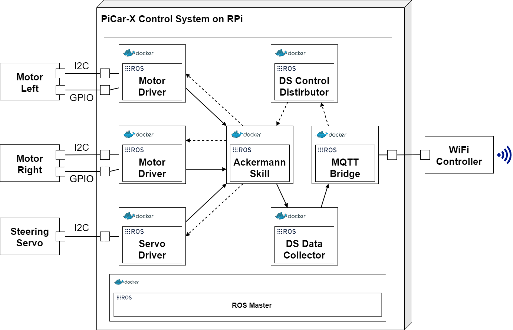

**This section is based on the publications:**
>[1] Barbie, A., & Hasselbring, W. (2024). From Digital Twins to Digital Twin Prototypes: Concepts, Formalization, and Applications. IEEE Access. [https://doi.org/10.1109/access.2024.3406510](https://doi.org/10.1109/access.2024.3406510)

>[2] Barbie, A., & Hasselbring, W. (2024). Toward Reproducibility of Digital Twin Research: Exemplified with the PiCar-X. arXiv preprint arXiv:2408.13866. [https://doi.org/10.48550/ARXIV.2408.13866](https://doi.org/10.48550/ARXIV.2408.13866)

# Context

With the increasing demand for context-aware, autonomous, and adaptive robotic systems, the embedded software community must adopt more advanced software engineering methods. As a result, the development processes for embedded software systems must evolve. In future workflows, embedded software systems will become the centerpiece of a product. To achieve this, the community needs to shift from expert-centric tools to modular systems that empower domain experts to contribute to specific parts of the system [1]. For instance, in the context of an autonomous car, the vehicle integrates multiple autonomous subsystems, such as sensors, navigation, communication, and control systems, each with distinct functionalities. These systems collaborate to enable the car to perceive its environment, make decisions, and act in real-time. This integration of software modules and physical components allows the car to operate autonomously in complex and dynamic environments, forming a system of systems [2].

While the PiCar-X is a less complex embedded system, we use it to exemplify our digital twin concept, which begins with the **physical twin**:

# Definition

A **physical twin** is a real-world physical System-of-Systems or product. It comprises sensing or actuation capabilities driven by embedded software.

## Key Points:
- A real object, such as a vehicle or machine.
- Equipped with sensors and actuators for interaction with its environment.
- In the context of the PiCar-X, the **physical twin** is the PiCar-X itself, with all its hardware components, including motors, sensors, and embedded software.

---

# Physical Twin of the PiCar-X

The first part of a PiCar-X's physical twin is the PiCar-x itself:

 

## List of Sensors/Aktuators and Connection Types
| Module | Interface | Description |
|--- |--- |--- |
|2x Motor | GPIO & I2C | Each motor moves one back wheel
|3x Servo | I2C | Turn front wheels left/right. Turn camera left/right and up/down.
|1x Camera | I2C | The video can be used for object detection
|1x Grey Scale |I2C | Used for path following
|1x Ultra Sonic | I2C | Used for collision avoidance
|1x HAT | - | Hardware attached on top (HAT) of the RPi. All sensors/actuators are connected to it.

## The Embedded Control Software
All hardware parts are connected to the HAT module, which sits on top of a Raspberry PI (3B+/4). The implementations are built upon the middleware [Robot Operating System (ROS)](https://ros.org) and the [ARCHES Digital Twin Framework]({{ site.baseurl }}). All nodes are encapsulated in [Docker](https://docker.com) containers.

The embedded control software running the PiCar-X looks like this:

 

Continue reading with [digital model]({{ site.baseurl }}).

