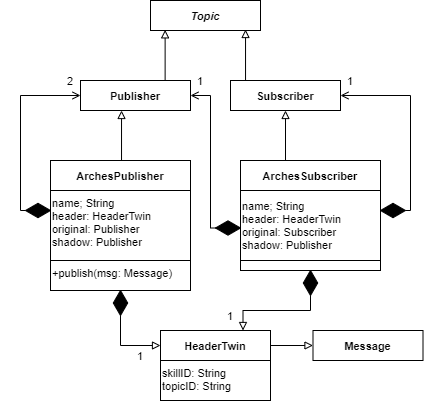

# The ARCHES Digital Twin Framework
This page gives a short overview of the ARCHES Digital Twin Framework [1]. This Framework was developed during the project ARCHES (Autonomous Robotic Networks to Help Modern Societies), where a network of underwater ocean observation systems was developed and successfully tested.

Consider a simple stationary observation system equipped with several sensors that store data measurement probes onboard, such as hourly readings. This system is designed to allow easy addition, removal, or replacement of sensors without affecting other parts of the system. However, limitations arise when a researcher or other entity needs to access or process the sensor data in real-time. Accessing and retrieving sensor data requires an additional system with access to the sensors, which must be adapted whenever sensors are added or removed. Consequently, with each new requirement, the complexity of the observation system increases [2].

Observation systems, cyber-physical systems, or embedded systems in general can be viewed as distributed systems. Instead of business workflows spanning different data centers, these systems involve sensors and actuators as distinct processes that need integration into a modular core system. The objective is to develop an embedded software system where changing sensors or actuators does not impact other software components.

The longstanding practice of developing embedded software using monolithic architectures has significantly influenced existing middleware and robotic systems. In these architectures, device drivers are often tightly coupled with the middleware used during the development of the embedded system~. This tight coupling creates challenges when attempting to generalize or adapt the software to other systems. For instance, when switching to a different middleware, the device driver must be redeveloped, even if the hardware logic remains unchanged. The same issue arises with algorithms that perform general tasks independent of the specific functions of the embedded system, such as pathfinding or image recognition.

We decided to use the middleware [Robot Operating System (ROS)](https://ros.org), which boasts a large and active community, a clear roadmap for long-term support (LTS) releases, bindings for all popular programming languages, and a straightforward publish-subscribe mechanism. It is important to note that when referring to ROS in this context, we mean ROS1. A successor, ROS2, is being developed concurrently and is set to replace ROS1.

ROS embodies five core concepts:

1. **Free and Open-Source:** ROS is released under the BSD license, making it freely available and open-source.

2. **Peer-to-Peer:** Instead of relying on a central server, ROS-based embedded software systems consist of multiple processes connected at runtime in a peer-to-peer topology. The message broker facilitating this communication is called the ROS Master.

3. **Tool-Based:** ROS features a microkernel design. Rather than using a monolithic structure with a master module providing all functions (such as a build system or global clock), ROS employs various tools to build and run different components. This approach reduces the complexity of the core library and provides developers with significant freedom in their choice of tools and libraries.

4. **Multi-Lingual:** ROS is designed to be language-neutral, with its specification focused on the messaging layer. Connection negotiation and configuration between processes occur via XML-RPC. A language-neutral interface definition language describes the messages sent between modules, enabling cross-language development.

5. **Thin:** To reduce dependencies between packages and the complexity of modules, drivers and algorithms are placed in standalone libraries that have no dependencies on ROS. These libraries are imported into ROS nodes and expose their functionality there. The ROS build system uses CMake to perform modular builds within the source code tree.

The ROS philosophy aligns with a service-oriented architecture strategy for embedded software. Its multi-language support allows researchers and engineers to develop algorithms and services in their preferred programming languages. Moreover, the *thin* design promotes clean architectures with small, manageable nodes.

# The Concept of Skills

To comply with one of ROS's fundamental design principles, maintain minimalism, it is recommended to develop independent libraries that do not rely on ROS [5]. Keeping this in mind, the ARCHES Digital Twin Framework (ADTF) provides a library to develop the phyiscal twin and digital and connect them via the digital thread.

The ADTF has three core principles [4]:
- Data/status messages are automatically sent from the physical twin to the digital twin;
- Command messages are automatically sent from the digital twin to the physical twin;
- All nodes are deployable in Docker containers;
- Features should be developed as microservices

In the following, microservices are referred to as *Skils**, drawing a metaphor similar to applications that can be installed on smart home devices like Amazon's Alexa.

## Definition
A **Skill** describes the capability that is added to the system by introducing a microservice. Services and drivers can be part of a Skill, but only the nodes that contain publishers or subscribers that are able to synchronize their messages with the physical twin or digital twin are referred to as **Skill**.

## Implement as Skill
The following code presents an example Skill named *ExampleSkill*, which subscribes to the topic *incoming/command* and publishes to the topic */A/B/C*. The subscriber is annotated with *@DigitalThread.control*, meaning events received on the physical twin trigger commands, while events received on the digital twin are forwarded to the physical twin. The publisher is annotated with *@DigitalThread.data*, indicating that all messages are transmitted to both the digital and physical twins.

These decorators, integral to the ADTF, uphold the thin paradigm. Behind the scenes, additional subscribers and publishers manage event exchange between twins, converting events into ROS messages of type *DigitalShadow*. The *@Skill* decorator ensures that publishers and subscribers use the ArchesPublisher and ArchesSubscriber, which add the correct HeaderTwin message for exchange. This approach prevents multiple Skills from publishing identical event types to the same topic, ensuring clarity in event origin, which is crucial for logging and debugging purposes. The Decorator [6] pattern allows developers to use the familiar ROS API, ensuring that all Skills operate in a standardized manner. This method facilitates seamless application of minor logic adjustments across all Skills, enhancing capabilities without disrupting user processes.

```python
class SensorSkill(Skill):
    @property
    def dataPublisher():
        return self.dataPublisher
    
    @Digitalshadow.data
    @dataPublisher.setter
    def dataPublisher(publisher: Publisher):
        self.dataPublisher = publisher
    
    @property
    def commandSubscriber():
        return self.commandSubscriber
    
    @Digitalshadow.control
    @commandSubscriber.setter
    def commandSubscriber(subscriber: Subscriber):
        self.commandSubscriber = subscriber
        
    def __init__() {
        super(SensorSkill, self).__init__(SensorSkill, SkillType.SENSOR, '')
        self.dataPublisher = new Publisher('/A/B/C', StandardO2, queue_size = 5)
        self.commandSubscriber = new Subscriber('incoming/command', 
            Command, self.commandCallback)
    }
    
    def commandCallback(rosmsg: Command) {
        // do something here
    }
```

Notice that device drivers are not forseen as skills. But any node that evaluates/transofrms/analyzes the interactions and data from the device drivers can be skills. 

## Examples
Examples of Skills provided by ADTF include the [*DigitalShadow-Collector*](https://git.geomar.de/open-source/arches/arches_core/-/blob/main/src/arches_core/digitalthread/digitalshadow.py) and [*DigitalShadow-Distributor*](https://git.geomar.de/open-source/arches/arches_core/-/blob/main/src/arches_core/digitalthread/digitalshadow.py) services. The collector gathers data for its twin, while the distributor forwards received data to corresponding topics. 

How the digital thread is established on a physical twin, is shown in the [PiCar-X's physical twin docker compose file](https://github.com/cau-se/ARCHES-PiCar-X/blob/main/PiCar-X/docker-compose-pt.yml). Vice versa, the [PiCar-X's digital twin docker compose file](https://github.com/cau-se/ARCHES-PiCar-X/blob/main/PiCar-X/docker-compose-dt.yml) file shows the usage on the digital twin side.

An available Skill using decorators for data exchange is the PiCar-X [Ackermann Driving Skill](https://github.com/cau-se/ARCHES-PiCar-X/blob/main/PiCar-X/ros/skills/ackermann_drive/src/picarx_ackermann_drive/skill.py).

# ARCHESPublisher and ARCHESSubscriber extend ROS Publishers and Subscribers
Leveraging the publish-subscribe architecture, we can seamlessly tap into publishers and subscribers for data exchange. Messages published by a node *XYZ* in topic *A/B/C* on one twin are synchronized with the corresponding twin on the same node and topic. The list of topics to synchronize with a twin is stored on the ROS Parameter Server and can include absolute (*/A/B/C*), relative (*B/C*), and wildcard topics (*A/B/**). 

This message exchange is implemented by extending the Publisher and Subscriber classes provided by ROS. The figure below depicts the UML class diagram illustrating this process in ADTF. The *ArchesPublisher* and *ArchesSubscriber* classes inherit functionalities from their ROS counterparts and incorporate additional features to correctly identify the corresponding topic on the twin system. 
This identification is managed through the [*HeaderTwin*](https://git.geomar.de/open-source/arches/arches_msgs/-/blob/master/msg/HeaderTwin.msg?ref_type=heads), which includes two unique identifiers: *skillID* and *topicID*, both ensuring uniqueness within the system at runtime. Both new classes encompass a publisher that forwards all incoming messages to nodes responsible for data exchange with the twin. The *HeaderTwin* message is attached to all messages exchanged between the twins.

 

The decorators for control and data shown above automatically create the *ArchesPublisher* and *ArchesSubscriber* in the background. Users can continue to use the standard ROS Publishers and Subscribers as they are accustomed to.

# A Dynamic Compact Control Language with Apache AVRO
Data exchange and interactions with the digital shadow constitute the digital thread [3]. A digital thread encompasses the seamless flow of data and information throughout the entire lifecycle of a product, including its design, development, operation, and maintenance. A robust digital thread provides a consistent view of the product's history, status, and performance.

However, transmitting data in Industry 4.0 applications consumes significant energy, posing challenges for embedded systems that rely on limited power sources such as batteries. Due to energy constraints, these systems cannot afford to send periodic data at high rates or transmit large volumes of data. Cellular communication standards like 5G prioritize high bandwidth but at the cost of increased energy consumption and reduced transmission range.

To address these challenges, alternative standards such as Bluetooth Low Energy (BLE), Long Range Wide Area Network (LoRaWAN), and Narrowband Internet of Things (NB-IoT) have been developed. These standards reduce energy consumption by trading off either bandwidth or transmission range.

In underwater applications - such as those in the [ARCHES](https://www.arches-projekt.de) project - the challenge of data transmission is exacerbated by the inability to use electromagnetic wave-based standards due to absorption by seawater. Acoustic communication serves as an alternative solution. While standards like BLE, LoRaWAN, and NB-IoT offer bandwidths in the kilobits-per-second range, acoustic communication reaches at best a few kilobits per second. The acoustic protocol used in ARCHES had a message size limit of 64 bytes.

Low bandwidth presents a significant hurdle for applications requiring data exchange. The ROS message definition for the message *StandardO2* is shown below:

```
time Time
float32 Oxy
float32 Sat
float32 Temp
```

This message contains a timestamp, oxygen concentration, saturation, and temperature from various oxygen sensors. The data types are C primitive types, with *time* being a nested ROS message containing two *long* values (*secs* and *nsecs*), totaling 10 bytes in size. Each *float32* occupies 4 bytes, so the total data size is 10 bytes (time) plus 12 bytes (three floats), amounting to 22 bytes. However, when considering serialization overhead, the entire message size increases to approximately 34 bytes. While such a message can be serialized into bytes for acoustic transmission, handling its deserialization at the receiver's end becomes a critical consideration.

In ROS, publishers and subscribers are configured with two essential pieces of information: the topic for sending or listening and the expected message type. Consequently, the default binary serialization of ROS messages may not be directly applicable in such constrained bandwidth scenarios, as the additional overhead could exceed the size limit. The human-readable representation of ROS messages is in inline YAML, which is similar to JSON, and is shown below:

```
{
  'Time': {'secs': 1554119012, 'nsecs': 513111},
  'Oxy': 234.87,
  'Sat': 104.7503,
  'Temp': 28.78
}
```

In this format, the message type is inferred from the field names, eliminating the need for explicit type knowledge. However, using human-readable formats introduces significant overhead. Each character occupies one byte, and the example message totals 109 characters, equating to 109 bytes. This exceeds the maximum size limit of 64 bytes, necessitating the transmission of two messages and resulting in increased energy consumption. While abbreviating field names, such as renaming *Oxy* to *O*, may reduce overhead, it does not fully resolve the inherent issues of using human-readable representations for data transmission.

To minimize data message overhead for acoustic communication while supporting various message types, researchers devised a binary serialization protocol utilizing [Google Protocol Buffers (Protobuf)](https://developers.google.com/protocol-buffers/docs/overview) [7]. Protobuf is widely used for efficient data transmission in client-server applications. However, when integrated with ROS, it has a drawback: it requires pre-compiled message definitions. Incompatibilities, such as differing message definitions or missing Protobuf messages on either side, can result in serialization errors, data corruption, and potentially catastrophic consequences for ocean observation systems that cannot be recovered from the sea surface. To mitigate these risks, a new control language based on [Apache Avro](https://avro.apache.org) was developed for use with ROS.

Avro is a data serialization system comparable to Protobuf. It offers robust data structures, a compact and efficient binary format, and seamless integration with dynamic languages like Python and Java. Avro's key advantage lies in its ability to perform binary serialization and deserialization dynamically, eliminating the need for pre-compiled code generation. Message schemas can be defined at runtime, allowing all control messages to be specified via ROS. In practice, ROS messages are serialized to or deserialized from Avro messages for efficient data transmission.

Avro messages are defined in JSON format and encompass primitive types such as *int32*, *float*, and *string*, as well as complex types like arrays, records (similar to objects), and enums. Like ROS messages, Avro messages can be nested and may include custom messages. The transformation from ROS to Avro messages involves two steps. First, the ROS message is converted into a NumPy record (NumPy is a fundamental library for numerical computing in Python). This step ensures that C primitive types are preserved in Python. Once the ROS message is converted to a NumPy record, it is then processed by Avro to generate the corresponding Avro message.

After parsing the message from above into an Avro message, its size reduces to just 22 bytes:

```
27 80 D1 42 B8 DE 6A 43 71 3D E6 41 C8 E5 8F CA 0B 94 D1 AB E9 03
```
**Note that the hex representation is used here for clarity.**

Similar to ROS message serialization, Avro messages also lack explicit information about their message types, which poses challenges for the receiving twin when attempting to deserialize the message back into a ROS format. To address this issue, the message type is prepended to the binary string and separated from the serialized ROS message using the delimiter *00*. An example is illustrated below for the ROS message type *StandardO*, resulting in a total size of 47 bytes:

```
61 72 63 68 65 73 5F 6D 73 67 73 2F 53 74 61 6E 64 61 72 64 4F 32
00
27 80 D1 42 B8 DE 6A 43 71 3D E6 41 C8 E5 8F CA 0B 94 D1 AB E9 03
```

Note that the ROS message name occupies 23 bytes including the delimiter. To minimize size for acoustic communication, we optimize by creating a sorted list of all known ROS messages in the system and assigning enumerations to them. In the Avro schema, these enumeration values replace the message names. For example, if the message type *StandardO2* is ranked 16 in the sorted list, the result is depicted below. 
```
10 00 2780D142B8DE6A43713DE641C8E58FCA0B94D1ABE903
```
This size is reduced to 24 bytes. However, for the PiCar-X example, the last reduction can be ignored, since it is not used.

# References
> [1] Alexander Barbie and Niklas Pech. ARCHES Digital Twin Framework. [Software]. 2022. [https://doi.org/10.3289/sw_arches_core_1.0.0](https://doi.org/10.3289/sw_arches_core_1.0.0) [Git Repository]: [https://git.geomar.de/open-source/arches/](https://git.geomar.de/open-source/arches/)

> [2] Barbie, A., Pech, N., Hasselbring, W., Flögel, S., Wenzhöfer, F., Walter, M., ... & Sommer, S. (2021). Developing an Underwater Network of Ocean Observation Systems with Digital Twin Prototypes - A Field Report from the Baltic Sea. IEEE Internet Computing, 26(3), 33-42.  [https://doi.org/10.1109/mic.2021.3065245](https://doi.org/10.1109/mic.2021.3065245)

> [3] Barbie, A., & Hasselbring, W. (2024). From Digital Twins to Digital Twin Prototypes: Concepts, Formalization, and Applications. IEEE Access. [https://doi.org/10.1109/access.2024.3406510](https://doi.org/10.1109/access.2024.3406510)

> [4] Barbie, A., & Hasselbring, W. (2024). Toward Reproducibility of Digital Twin Research: Exemplified with the PiCar-X. arXiv preprint arXiv:2408.13866. [https://doi.org/10.48550/ARXIV.2408.13866](https://doi.org/10.48550/ARXIV.2408.13866)

> [5] Quigley, M., Conley, K., Gerkey, B., Faust, J., Foote, T., Leibs, J., ... & Ng, A. Y. (2009, May). ROS: an open-source Robot Operating System. In ICRA workshop on open source software (Vol. 3, No. 3.2, p. 5).

> [6] Erich Gamma, Richard Helm, Ralph Johnson, and John Vlissides. Design Patterns: Elements of Reusable Object-Oriented Software. Pearson Deutschland GmbH, 1995.

> [7] Schneider, T., & Schmidt, H. (2010, May). The dynamic compact control language: A compact marshalling scheme for acoustic communications. In OCEANS'10 IEEE SYDNEY (pp. 1-10). IEEE. [https://doi.org/10.1109/OCEANSSYD.2010.5603520](https://doi.org/10.1109/OCEANSSYD.2010.5603520)