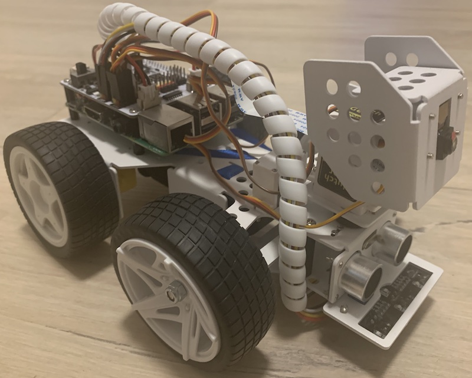
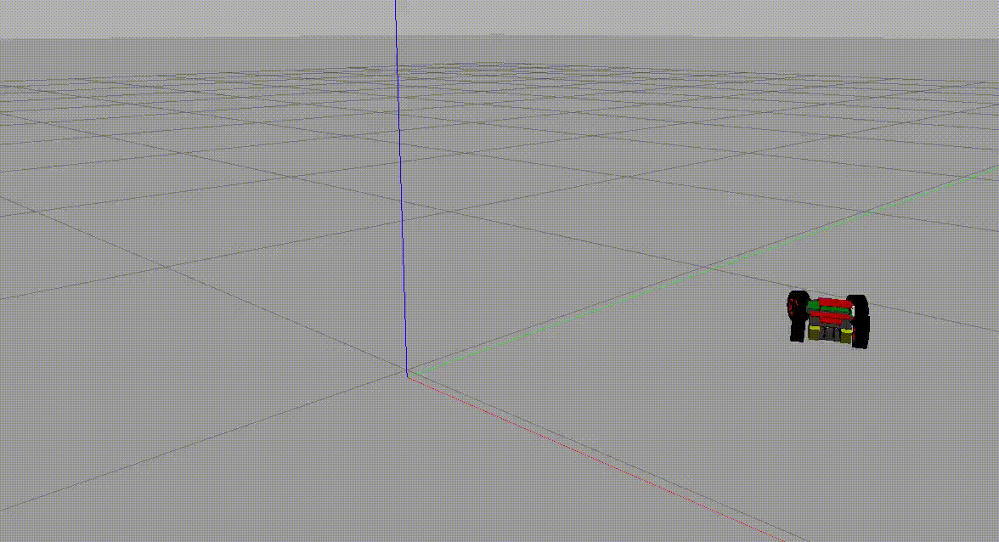

<link rel="stylesheet" href="{{ site.baseurl }}">
<script src="{{ site.baseurl }}"> </script>

# Getting Started
This project based on ROS and Docker. Due to the used interfaces on the RPi, we have to use Linux Kernel functions for GPIO and I2C. Before you can start this project you need to [install Docker](https://docs.docker.com/engine/install/ubuntu/#install-using-the-convenience-script) and you have to [check whether the GPIO and I2C modules are installed](#check-if-required-modules-are-installed). If these modules are installed already, you can proceed with [activating I2C and GPIO](#activate-gpio-and-i2c-on-your-system).

| The PiCar-X by Sunfounder| The digital twin prototype in GAZEBO   |
| -------------------------------------------------------------------- | ------------------------------------------------------------------------------------------------- |
|  |  |


## Clone Repository
```console 
git clone https://github.com/cau-se/ARCHES-PiCar-X.git
cd ./ARCHES-PiCar-X/PiCar-X
```

## Check if required modules are installed
```console
modinfo i2c-stub
modinfo i2c-dev
modinfo gpio-mockup
```

**If one of the modules is missing follow the installation guides**

- [Install on Ubuntu 20.04]({{ site.baseurl }})
- [Install on Windows (with WSL2)]({{ site.baseurl }})

## Check if there is already an existing I2C

On Ubuntu Systems (not WSL) there can already be an I2C device active. To check if a device already exists, type:

```console
ls /dev/i2c*
```

If there is already an active I2C device, the result can be something like `/dev/i2c-0`. **The listed devices cannot be used for the DTP.**


## Activate GPIO and I2C on Your System

If you already have built the modules, you need to activate them via:

<div class="tab-container" id="activateinterfaces">
  <ul class="tab-list">
<li class="tab active" data-tab="tab1-1">X64</li>
<li class="tab" data-tab="tab1-2">RaspberryPi 3/4</li>
  </ul>
  <div class="tab-content active" id="tab1-1">
  
sudo modprobe gpio-mockup gpio_mockup_ranges=1,41
sudo modprobe i2c-dev
sudo modprobe i2c-stub chip_addr=0x14 
  </div>
  <div class="tab-content" id="tab1-2">
  
sudo modprobe i2c-stub chip_addr=0x14   
  </div>

</div>

Type again:
```console
ls /dev/i2c*
```

If there was already and existing I2C device (see above), then a new would should be listed now. The result can be something like `/dev/i2c-0 /dev/i2c-1` and `/dev/i2c-1` is the created device that can be used for the DTP.

If there a several devices, use `i2cdetect` provided in `i2c-tools`:
```console
i2cdetect -l
```

The result can look like:

i2c-1   i2c             bcm2835 (i2c@7e804000)                  I2C adapter
i2c-11  smbus           SMBus stub driver                       SMBus adapter


In this example, `i2c-11` is the stub that was created above and can be used for the DTP.


## Enable Gazebo GUI
Before starting the Docker containers, enable the X11 forwarding to the hosts display:

```console
# Alternative 1: Allow all connetions
xhost + 

# Alternative 2: Allow non-network local connections
xhost + local:root
```

**DEACTIVATE AFTER SHUTDOWN**
```console
# Alternative 1: Disable all connetions
xhost - 

# Alternative 2: Disable non-network local connections
xhost - local:root
```


## Build and Start Docker Containers from Scratch

You need to configure the correct I2C device in the `env` folder (`ARCHES-PiCar-X/Picar-X/env`). Which env is used, can be seen in the docker compose file you want to execute.


<div class="tab-container" id="startdocker">
  <ul class="tab-list">
<li class="tab active" data-tab="tab2-1">X64</li>
<li class="tab" data-tab="tab2-2">arm32v7 (RPi3)</li>
<li class="tab" data-tab="tab2-3">arm64v8 (RPi4)</li>
  </ul>
  <div class="tab-content active" id="tab2-1">
  
# Build and execute the Docker Containers
docker compose -f docker-compose-core.yml build 
docker compose -f docker-compose-dtp.yml build 
docker compose -f docker-compose-dtp.yml up  
  </div>
  <div class="tab-content" id="tab2-2">
  
# First copy all content to the RaspberryPi3
scp -r ./ <user>@<picarx-ip>:~/

# Login to the RaspberryPi via ssh
ssh <user>@<picarx-ip>

# Build and execute the Docker Containers
TAG=latest ARCH=arm32v7 docker compose -f docker-compose-core.yml build 
TAG=latest ARCH=arm32v7 docker compose -f docker-compose-dtp-no-gazebo.yml build 
TAG=latest ARCH=arm32v7 docker compose -f docker-compose-dtp-no-gazebo.yml up   
  </div>
  <div class="tab-content" id="tab2-3">
  
# First copy all content to the RaspberryPi4
scp -r ./ <user>@<picarx-ip>:~/

# Login to the RaspberryPi via ssh
ssh <user>@<picarx-ip>

# Build and execute the Docker Containers
TAG=latest ARCH=arm64v8 docker compose -f docker-compose-core.yml build 
TAG=latest ARCH=arm64v8 docker compose -f docker-compose-dtp-no-gazebo.yml build 
TAG=latest ARCH=arm64v8 docker compose -f docker-compose-dtp-no-gazebo.yml up    
  </div>

</div>


## Build and Start the Physical Twin on a RPi 3/4

You need to configure the correct I2C device in the `env` folder (`ARCHES-PiCar-X/Picar-X/env`). Which env is used, can be seen in the docker compose file you want to execute.

<div class="tab-container" id="activaterpi">
  <ul class="tab-list">
<li class="tab active" data-tab="tab3-1">arm32v7 (RPi3)</li>
<li class="tab" data-tab="tab3-2">arm64v8 (RPi4)</li>
  </ul>
  <div class="tab-content active" id="tab3-1">
  
# First copy all content to the RaspberryPi4
scp -r ./ <user>@<picarx-ip>:~/

# Login to the RaspberryPi via ssh
ssh <user>@<picarx-ip>

# Build and execute the Docker Containers
TAG=latest ARCH=arm32v7 docker compose -f docker-compose-core.yml build 
TAG=latest ARCH=arm32v7 docker compose -f docker-compose-pt.yml build 
TAG=latest ARCH=arm32v7 docker compose -f docker-compose-pt.yml up  
  </div>
  <div class="tab-content" id="tab3-2">
  
# First copy all content to the RaspberryPi4
scp -r ./ <user>@<picarx-ip>:~/

# Login to the RaspberryPi via ssh
ssh <user>@<picarx-ip>

# Build and execute the Docker Containers
TAG=latest ARCH=arm64v8 docker compose -f docker-compose-core.yml build 
TAG=latest ARCH=arm64v8 docker compose -f docker-compose-pt.yml build 
TAG=latest ARCH=arm64v8 docker compose -f docker-compose-pt.yml up    
  </div>

</div>


## Let the ARCHES PiCar-X Drive

After you start all Docker containers, you can switch into one of the containers and publish a picarx_msgs/Drive message, which will move the DTP with a certain speed and steering angle.

<div class="tab-container" id="activaterpi">
  <ul class="tab-list">
<li class="tab active" data-tab="tab4-1">Start the Digital Twin Prototype</li>
<li class="tab" data-tab="tab4-2">Start the Physical Twin</li>
  </ul>
  <div class="tab-content active" id="tab4-1">
  
# SWITCH INTO THE CONTAINER
docker exec -it picar-x-ackermann_skill-dtp-1 /bin/bash

# INSIDE CONTAINER
source /root/catkin_ws/devel/picarx_ackermann_drive/setup.bash

# PUBLISH A MESSAGE TO TURN RIGHT WITH 50 percent motor speed
rostopic pub /picarx/drive/command picarx_msgs/Drive "{speed: 50, angle: 20}"

# PUBLISH A MESSAGE TO TURN LEFT WITH 80 percent motor speed
rostopic pub /picarx/drive/command picarx_msgs/Drive "{speed: 80, angle: -20}"

# PUBLISH A MESSAGE TO TURN THE WHEELS LEFT BUT DRIVE BACKWARD WITH 80 percent motor speed
rostopic pub /picarx/drive/command picarx_msgs/Drive "{speed: -80, angle: -20}"    
  </div>
  <div class="tab-content" id="tab4-2">
  
# SWITCH INTO THE CONTAINER
docker exec -it picar-x-ackermann_skill-pt-1 /bin/bash

# INSIDE CONTAINER
source /root/catkin_ws/devel/picarx_ackermann_drive/setup.bash

# PUBLISH A MESSAGE TO TURN RIGHT WITH 50 percent motor speed
rostopic pub /picarx/drive/command picarx_msgs/Drive "{speed: 50, angle: 20}"

# PUBLISH A MESSAGE TO TURN LEFT WITH 80 percent motor speed
rostopic pub /picarx/drive/command picarx_msgs/Drive "{speed: 80, angle: -20}"

# PUBLISH A MESSAGE TO TURN THE WHEELS LEFT BUT DRIVE BACKWARD WITH 80 percent motor speed
rostopic pub /picarx/drive/command picarx_msgs/Drive "{speed: -80, angle: -20}"  
  </div>

</div>

# Next Steps
- Visit the [Digital Twin Concept page]({{ site.baseurl }}) to get more information on the digital twin concept we are demonstrating with ARCHES piCar-X
- Visit the [Explore page]({{ site.baseurl }}) to get more information on how you can use the PiCar-X to explore implementations, functions, and setups of digital twins.

# Troubleshooting
Sometimes there can be problems with the I2C devices (e.g. a folder was created upon mounting) or the GPIO pin was not removedproperlly.
See [Troubleshooting page]({{ site.baseurl }}) for solutions.
