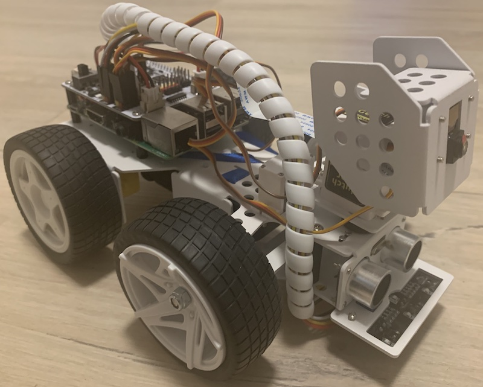

# Summary
This paper presents a digital twin prototype of the [PiCar-X by Sunfounder](https://www.sunfounder.com/products/picar-x) based on the middleware [Robot Operating System (ROS)](https://ros.org), Docker, and the ARCHES Digital Twin Framework, which provides tools to exchange data between a physical and digital twin. The digital twin prototype can be used to test all software functions without needing to use the physical PiCar-X. The actual hardware is replaced with emulators or a simulation, and the interfaces are virtualized. Our goal is to provide researchers and practitioners with an affordable and straightforward example to explore how the concepts physical twin, digital model, digital template, digital thread, digital shadow, digital twin, and digital twin prototype can be implemented. These concepts were originally used for development, testing, monitoring, and operating an underwater network of ocean observation systems in the project ARCHES (Autonomous Robotic Networks to help Human Societies).

# Statement of need
Digital twins are becoming increasingly relevant in the Industrial Internet of Things and Industry 4.0, enhancing the capabilities and quality of various applications [@kritzinger:2018]. However, the concept of digital twins lacks a unified definition and faces validation challenges, partly due to the scarcity of reproducible modules or source codes in existing studies. While many applications are described in case studies, they often lack detailed, re-usable specifications for researchers and engineers.

In [@barbie:2024], we formally specified a digital twin concept including its sub-concepts physical twin, digital model, digital template, digital thread, digital shadow, digital twin, and digital twin prototype using the Object-Z notation. These concepts were developed for a network of ocean observation systems and the results were evaluated in a real-world mission in the Baltic sea in Oktober 2020 [@demomission:2020]. One of the results of the successful proof-of-concept was the ARCHES Digital Twin Framework [@ADTF:2022], a software package providing the functionality to implement the digital thread between physical twins and digital twins.
Ocean observation systems use quite specific and expensive hardware, hence, we see the need of a cheap lab experiemnt to enable independent evaluation and exploration of the different concepts. The PiCar-X example demonstrates all the concepts from the ocean observation system and includes also a full integration test pipeline, see our GitHub Repository [@archespicarx:2024]. In [@barbiepicarx:2024], we elaborate in more detail how the PiCar-X can be used to evaluate all these concepts.

# The PiCar-X and its Digital Model
The PiCar-X is a toy car, see \autoref{fig:picarx-pt}, with all sensors and actuators connected to a RaspberryPi. Two direct current motors (DC motors) are used to move the car. A servo motor at the front is used to steer the car. The steering is a typical Ackermann steering [@Veneri:2020] known from common cars. The PiCar-X also includes grey-scale sensors for line following, infrared sensors for collision avoidance, and a camera. However, in the current example only the DC motors and the servo motor for steering are included, so far. All software components are implemented using the ROS middleware and containerized in Docker. The ARCHES Digital Twin Framework establishes the digital thread between the physical twin and the digital shadow/twin [@barbiepicarx:2024].

{ width=70% }

Lacking official CAD files for the PiCar-X, we utilized a simplified CAD model of an [older SunFounder PiCar version](https://github.com/Theosakamg/PiCar_Hardware), see \autoref{fig:picarx-dm}, available under Apache 2.0 license on GitHub. This model, consisting of just the frame and wheels, closely mirrors the original PiCar-X's key dimensions like wheelbase and track, crucial for an accurate Ackermann steering simulation. However, the original PiCar-X's steering mechanism, operated by a steering bar to achieve Ackermann angles, could not be replicated in [GAZEBO](https://gazebosim.org/). Instead, we approximate the Ackermann steering angles for both front wheels based on established methodologies [@Veneri:2020].

{ width=70% }

The PiCar-X can also be used to explore the digital twin prototype approach utilized in the smart farming application SilageControl [@silagecontrol:2024].

# The Digital Twin Prototype
A digital twin prototype serves as the software counterpart of a physical twin, with identical configurations [@barbie:2024]. However, instead of physical sensors and actuators, emulators are used to mimic their functions. These emulators utilize existing sensor and actuator recordings to emulate the physical twin's behavior. This allows the digital twin prototype to replace the physical twin during development and for integration testing in CI/CD pipelines.

The core of the digital twin prototype approach involves replacing all physical sensors and actuators with emulations or simulations, effectively virtualizing the hardware interfaces. As a result, the device driver cannot - and does not need to - distinguish between a real sensor/actuator and its emulated equivalent. The ARCHES PiCar-X uses emulators connected to a [GAZEBO](https://gazebosim.org/) simulation. The simulation provides the virtual context for the emulators, instead of using recordings from previous runs.

For the PiCar, the primary interfaces, GPIO and I2C, are emulated using Linux kernel tools. The virtual GPIO interaction module (gpio-mockup) and the I2C chip (I2C-stub) are integrated into the container for these emulation purposes. Additionally, with Windows 10 and later versions offering a built-in Linux virtual machine through WSL2, these interfaces can also be enabled and utilized on Windows systems. This setup provides a flexible and adaptable environment for emulating the PiCar's hardware interactions. The configuration of the digital twin prototype is illustrated in \autoref{fig:picarx-dtp}. The digital twin prototype can be started using the provided Docker compose files.

# Automated Integration Testing of Embedded Software in CI/CD Pipelines
Test automation has been identified as one of the most prominent areas in the testing of embedded software [@studyembeddedtesting:2018]. However, achieving effective automated quality assurance remains challenging, mainly due to the need for hardware involvement in the testing process. Testing on the actual system often requires a continuous connection to the testing environment, which can be expensive and impractical, especially for small and medium-sized enterprises [@silagecontrol:2024]. To address this issue, the digital twin prototype is designed to operate independently of the physical system while still enabling the testing of real embedded software.

\autoref{fig:picarx-cicd} illustrates an automated CI/CD pipeline for the ARCHES PiCar-X. Whenever a user commits changes, a GitHub Runner is triggered to build a Docker container. This container loads all dependencies and compiles the code. The build step could also include static software checks to further evaluate the code's quality. Once the containers are successfully built, unit tests are run on the module under test. If these tests pass, the process moves to the next crucial phase: integration testing.

To demonstrate how the digital twin prototype can be leveraged for automated integration testing without requiring physical hardware, we created an integration test based on the script used for speed measurement [@barbiepicarx:2024]. This test ensures that the digital model in the simulation operates at the same speed as the real one. After passing the integration tests, the various Docker containers are released.

The CI/CD pipelines are executed on three runners in parallel: one for x64 systems, one on a Raspberry Pi 3 (arm32v7), and another on a Raspberry Pi 4 (arm64v8). Note that only the x64 runner can execute the integration tests using the virtual context from the [GAZEBO](https://gazebosim.org/) simulation, as GAZEBO does not have an ARM build available.

# Acknowledgements
We thank the GitHub user [Theosakamg]((https://github.com/Theosakamg)) for providing a CAD model of a PiCar-V under an open source license.

# References
